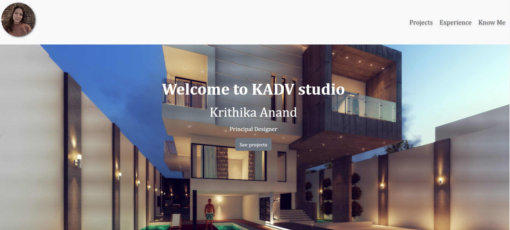
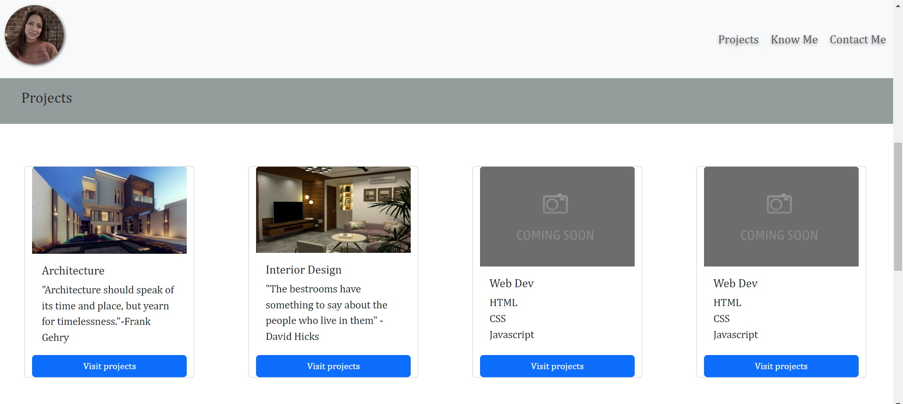
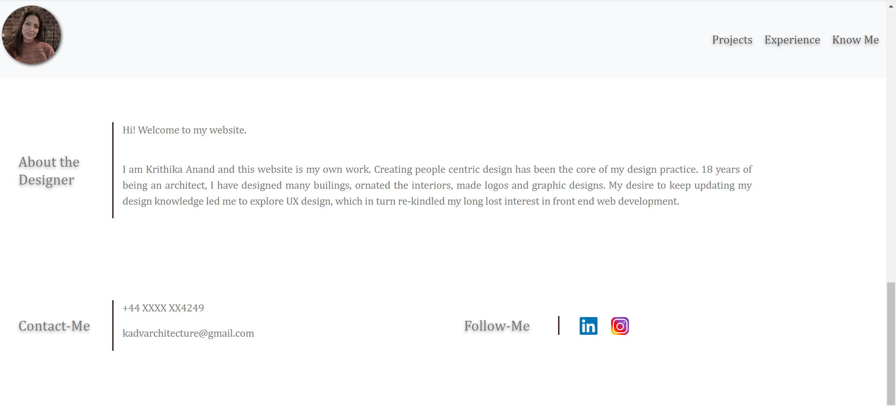

# Bootstrap-portfolio-Frontend

[link] https://krithika-anand.github.io/Bootstrap-portfolio-Frontend/

### Challenge 2 - portfolio link

[link] https://krithika-anand.github.io/Krithika-portfolio/

# Unit 3 Challenge: Code Bootstrap Portfolio

 

  ### Navigation bar  
    - A fixed navbar the top created using bootstrap elements

           Links navigate to the appropriate sections
           My photo will take to homepage 

              <nav class="navbar fixed-top bg-body-tertiary">
        

            

                
            

            <ul class="nav justify-content-center">

                <li class="nav-item">
                    <a class="textshadow" class="nav-link" href="#projects">Projects</a>
                </li>
                <li class="nav-item">
                    <a class="textshadow" class="nav-link" href="#experience">Experience</a>
                </li>
                <li class="nav-item">
                    <a class="textshadow" class="nav-link active" aria-current="page" href="#aboutMe">Know Me</a>
                </li>

            </ul>
        

    </nav>
  

### hero section

    Using jumbotron created a picture, included my name, and any other information. Also created a button to go to my projects section.

       
### work section

    section displaying my work in grid. 

    Used bootstrap cards for each project.

  project is linked to hyperlinks!

 ### Know me section (about / contact section).

      - An "About Me" section in the same row.
    
    - A footer section.

      - All hyperlinks have a hover effect.

      - All buttons display a box shadow upon hover.

